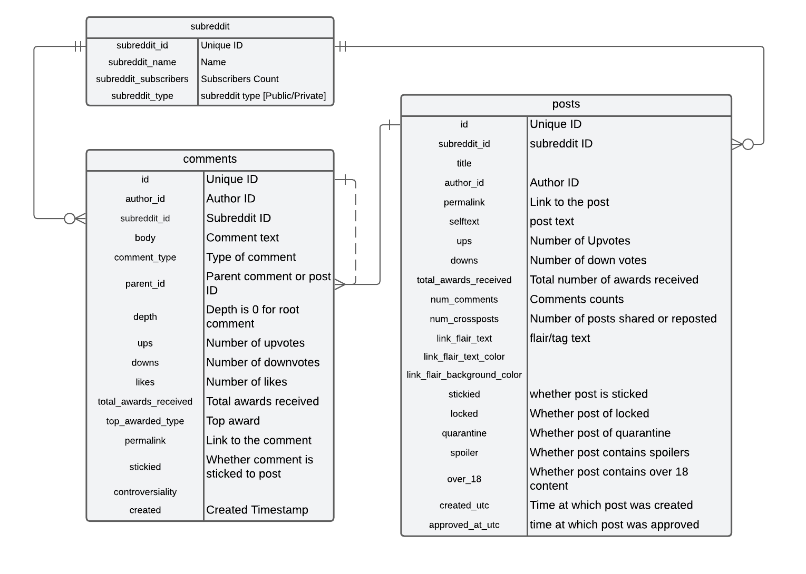

# reddit-data-engineering-project

## Problem Statement

- Find most influentials users in subreddits. Who are the most influential users in a subreddit?
- We will focus on below 3 subreddits:
    - r/dataengineering
    - r/MachineLearning
    - r/datascience

## Basics of Reddit and User Interactions

- **Subreddits:**

Reddit is organized into communities called subreddits, each dedicated to a specific topic (e.g., r/dataengineering for data engineering).
Each subreddit has its own set of rules, moderators, and culture.

- **Posts and Comments:**

Users submit posts (text, links, images, or videos) to a subreddit. These posts can be upvoted or downvoted by other users.
Within a post, other users can leave comments, which are also upvoted or downvoted. Comments can lead to threads of nested replies, creating an in-depth discussion.

- **Voting and Karma:**

Upvotes and downvotes on posts and comments represent user opinions, contributing to the overall score or visibility.
The sum of upvotes and downvotes on a post or comment determines its karma, and each user accumulates karma based on their posts and comments across Reddit. Karma is a measure of engagement, not quality, but high karma usually signals high user influence. Comments are also given awards.

## Implementation

### Overview

- Create a pipeline to pull the data from reddit and store it in datawarehouse like Bigquery,
- Schedule the pipeline to pull the latest data and keep historical records in Bigquery.
- Aggregate and find the useful metrics.

### Architecture Diagram

### Tables Schema (ERD)

### Define Metrics

- Influence is being measured in terms of engagement. There can be 2 kinds of engagement metrics.
1. Quantity:
    Frequency score is the sum of:
        - Post Frequency: Number of posts in one week
        - Comment Frequency: Number of comments in one week

2. Quality:
    Engagement score is the sum of:
        - Average Post Karma
        - Average Comment Karma
        - Average Comments Per Post
        - Total Awards

Final influence score can be measured as frequency score + engagement score. 

> If required, we can introduce weights to each individual metrics and weights can be adjusted as per the need.

> All these metrics, can be calculated as per the timeline. Last month, Last 3 months, etc. Longer duration can be considered to identify established users.

## Future Efforts

1. Network Analysis with Graph Databases

- Import user data into a graph database, where:
    Nodes represent users.
    Edges represent interactions (comments, replies).
- Graph Algorithms for Influence:
    Centrality Measures: Apply PageRank, Betweenness, or Closeness centrality to identify influential nodes (users).
    Community Detection: Use clustering algorithms to identify groups of interconnected users.

2. Visualization

- Network Visualization: Visualize the network graph, highlighting central (influential) users. Tools like Gephi or NetworkX (with matplotlib) can help.
- Dashboards: Create dashboards using tools like Tableau or Power BI to visualize user statistics, sentiment trends, and engagement.

3. CI/CD setup.

